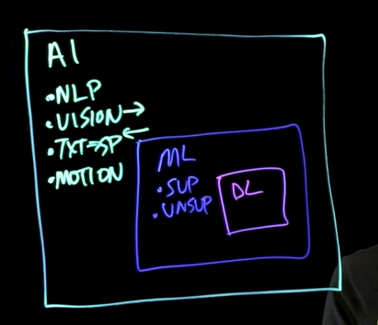

AI基础定义：

AI的能力定义：

- 查找新信息的能力
- 推断能力（从读取其他来源尚未明确的说明信息）
- 推理能力（解决问题的能力

机器学习设计哪些事情？

- 机器学习涉及基础数据的预测和决策，即一种非常复杂的统计分析形式，我们输入到系统的信息越多，它就越能够根据这些数据为我们提供准确的预测和决策  这就是Learn的L部分，
  ML和编程就在于  ML是根据数据来学习  编程是改变逻辑代码，所以他是基于大量的信息病有几个不同的类型

  - 监督机器学习
  - 无监督机器学习

  顾名思义就是认为监督打标的意思

  机器学习的一个领域就是 深度学习

深度学习：

神经网络设计节点以及这些节点的统计关系，以模拟我们的思维方式

他们的关系式

 

生成式人工智能的三个阶段

1. 训练，皆在创建基础模型
2. 调整，皆在使模型适应特定的应用程序
3. 生成、评估和进一步调整，皆在提高准确性

笔记来源：https://www.ibm.com/cn-zh/think/topics/artificial-intelligence
